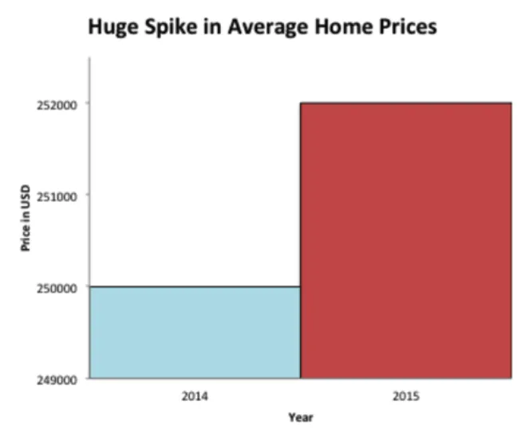

# Title

Most people don't need to be fully acquianted with statistics.

This is a good thing.

The world CHECK would be a very boring place if everyone knew what STATISTICAL THEORY was.

BUT everyone could do with a basic understanding of the most-common statistical traps.
Understanding of these will have practical consequences for you in every-day life.

Luckily, there aren't that many and they aren't that hard to understand.

### What do the numbers actually say?

This might sound utterly redundant to express but:

Before letting data inform your decisions, it's good to know what the data...actually...is.

Sounds simple, right?

But journalists, scientists, salesmen, etc. have all figured out sneaky ways to massage data to
do their evil bidding.

There are some common places that these techniques are deployed:

Headline --> EATING RASBERRYS INCREASES THE CHANCES OF THUMB CANCER BY 10%. Let's take this as true.
Ok. Fine. I never liked my thumbs that much anayway. But as we read on we discover that the type of
berry consumption increases our chances from 0.000001% to 0.0000011%. So the headline is technically
correct but kind of misleading. Or let's say this study was conducted on left-handed 65-year-old women.
I would quit like to know that before declaring war on rasberrys. Ignore the headline and try and focus on
the data in raw form.

Visualisations --> people choose the timeline, axes, colours, etc. to best sell whatever it is they are trying
to sell. There are many tricks here (check out the wikipedia page!) but the most common is probably the choice of
axes: magnifying axes to increase the perceived effect size and shrinking them to achieve the opposite effect.

Something like this:

_Source: https://www.ck12.org/c/statistics/misleading-graphs-identify-misleading-statistics/lesson/Identification-of-Misleading-Statistics/_

What did we learn about headlines? Apparently there is a "Huge Spike" - but is 250000 to 252000 really huge? Less than 1%?
Looking at the chart, it certainly looks big. But look at the y-axis! It's been truncated such that the max is 252000
and the min is 249000. Bastards. You can make any difference appear large by using this trick.

Numbers --> issues with numbers stated in the actual text are less obvious. The violations are harder to spot.
You usually have to ask yourself more nuanced questions such as where did the data come from? Does this apply to
me? What are they using as the definition of that? Was the experiment soundly designed?

### How much data?

The next thing to consider is how many observations people are drawing conclusions from.

Consider thumb cancer again - if this is based on a study of 3 people, I'm not likely to be that interested.
Why? Not because this means that the results, or even the conclusion drawn from them, is wrong, it's that
we have no reason to believe they are right.

This is a mistake of generalising from the particular, of assuming something will apply to everyone (including you)
because that was the effect observed for some other group. This is not always true, particularly if that group is small.
These errors happen all the time. Person of type X did this bad thing = everyone of type X is bad. This thing worked
for my friend = it will work for me. This person got rich doing this = I will get rich doing this.

We can explain using a simple hypothetical experiment.

Imagine your friend tells you that he ate a raw onion before bed last night and he slept like a baby - will
you sleep well if you do the same? We can't conclude much from this. There are a whole host of explanations other than
onions cause good sleep. If he has been doing this for 20 years, with many different periods of eating and
non-eating, with precise ways to measure sleep quality, and significant differences in sleep every time, I might
be more inclined to believe him. Similarly, if this was the whole world doing this experiment and relaying the
same result, I might be more inclined to draw a conclusion.

That's the idea of sample size. We have some statistical definitions of what results are "significant" and how
many samples should be drawn (for some things) LINK, but the general point is to be aware of how many samples/observations
are being used to make conclusions.

### Just because two things happened at the same time, doesn't mean that they are in any way related

Not much explanation required here. I'll just list some random examples for fun:

- Lucky socks and passing exams
- Blowing on dice and winning more DICE GAME
- Playing the left back higher up the pitch and going on a win-streak
- The position of jupyter's third moon and your level of concientousness CHECK
- The price of Barclays Bank PLC and WTI Crude
- Sales boost in Q4 after mandating return to office
- Economic boom under prime minister Y CHECK

Statisticians call this lesson _correlation is not causation_. Meaning that if the level of two things moves in
some way in conjunctions with one another, this doesn not necessarily imply that one is in any way causing the other.

### Someone has to win

Let's say we have a lots of data. A big sample size. Plenty of numbers.

As discussed above, this is usually a good thing because we are usually more confident
aggregate outcomes are true, and we can test the WORD of individual outcomes.

But it comes with its own problems. When the sample size is large, extraordinary outcomes
are likely to occur purely by chance.

Three specific ways this annoys me:

**What are the chances?!** Did you ever see someone from your school on holiday
and everyone completely lost their shit? Seemingly understandably - what are the chances
of seeing that person that I know from England here in this exact location here in Turkey
at this exact time? Very low. But that's not what happened - you're seeing _someone_ one of
you has met before. When the sample size is large, extraordinary outcomes
are likely to occur purely by chance. You're bound to bump into someone that you know.
Especially given that people you know read the same things, talk to the same people,
work in the same industries, send their kids to the same schools, etc. as you. There are only
so many popular destinations, recommended hotels within those locations, and conveniant
weeks to go to those locations. So, Mum, what are the chances? Quite high, actually.

**It can't be luck.** The chances of my flipping 5 heads in a row right now is very low.
If I bet you £30 that I can, and then proceed to do so, it's very likely that I have
skill in flipping heads. But if you ask XXX number of people to do this, someone is
likely to flip 5 heads in a row just by chance. Or a real-world manifestation: if
500 companies are betting on which companies will succeed or not, a few of them are likely
to make good predictions over an extended period of time...just by pure luck.

**P-hacking.** When people are conducting experiments, they are often concerned about whether
their results were just pure chance, or if some type of significant effect present that
altered the outcome. If your experiment is correctly designed, this statistical significance
is easy to calculate. But what if I do several experiments? Let's say a p-value (just a way
of measuring statistical significance CHECK/LINK) indicates that there is a 5% chance the
results would occur by pure chance. Now what happens if I do the experiment >20 times? It's
likely I would get these results by luck, even though a true effect is not present. You may not
think this is a problem but consider 1) "scientists" are massively incentivised to produce
significant results so that they can publish those results and 2) there are loaaaads of experiments
and studies going on all the time LINK TO YT VIDEO.

### What conditioner do you use?

_Note: awareness of conditional probability required here. Skip at wil._

Consider the sighting of the holiday friend again. This is also an error of _conditioning on the wrong thing_.

My Mum was considering the probability of seeing *one exact person*, not conditioning on anything:

P(Seeing Person X) = 1/population of planet Earth --> veeeeeeery small

She wasn't taking into the fact that this person was very similar:

P(SPX | that someone is a very similar person) --> a loooooot higher

Or that she would have a similar reaction to anyone we knew. Which is 1 - the probability
of not seeing any of those people:

1- [(1 - P(SPX | ...)) * (1 - P(SPY | ...)) ...]

Which I would posit CHECK is greater than 0.5. Mum was conditioning on the wrong thing.

People make this type of error all the time. The other classic (and by classic I mean
makes me pull my hair out, hence my lack of said hair) is "more likely to" QUOTE!!! "facts".

"You're more likely to be struck by lighting than be eaten by a shark."

Apparently this is a FACT.

And it is in some sense: more people **globally** per year get hit by lighting than eaten by a shark.
But this is a misleading, pointless, dangerous tidbit that doesn't explain anything and has no value
except for people to offer a "fun fact" when they need one.

Because it entirely depends on what circumstances you find yourself in. If I go swimming off the coast of South
Africa every day, my chances of shark attack go up substantially. Or they might change if I'm an
SOMEONE THAT INVESTIGATES LIGHTNING.

### Behave!

This is a relatively technical point. Some (relativity) high-level shit. So if you understand this
you'll be more statistically aware than like 90% of the general pop. And probably more (suitably)
skeptical than 90% of the pop that uses data.

As awlays, due to lack of iamgination, let's re-consider a previous example: flipping lots of coins.
Recall we could be very certain (in probability) of characterisitcs of our coin-flip experiment. We knew
five heads was unlikely, for example. Why do we know this?

Firstly it's becasue the distribution of outcomes is easy to work with. It is TECHNICAL TERMINAOLOGY ALERT
bounded, with finite mean and variance LINKS. These are nice properties that are handy to have when
performing probabilistic calculations.

Implicit in this calculation also is the idea that the coin will not change in its distributuion of outcomes.
If we changed the coin for one that had heads on both sides, the chances of flipping head 5 times in a row changes
quite a bit.

